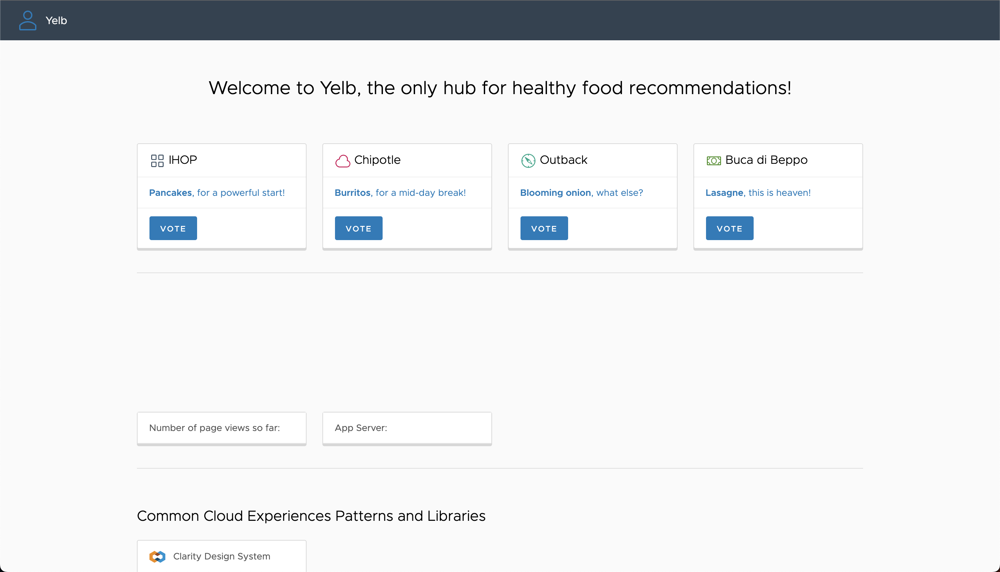
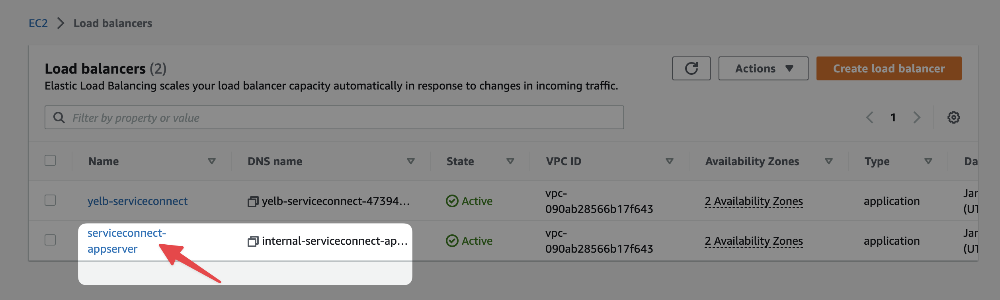
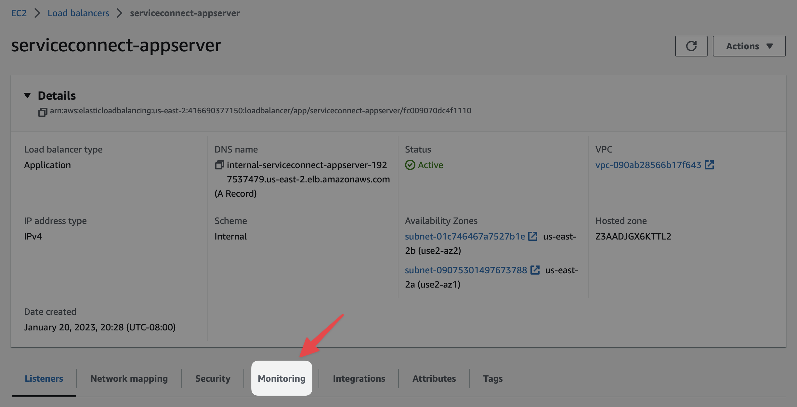
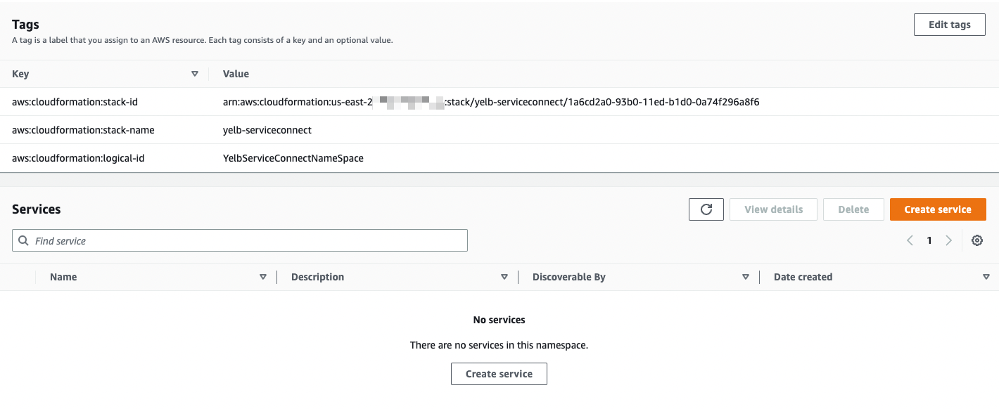
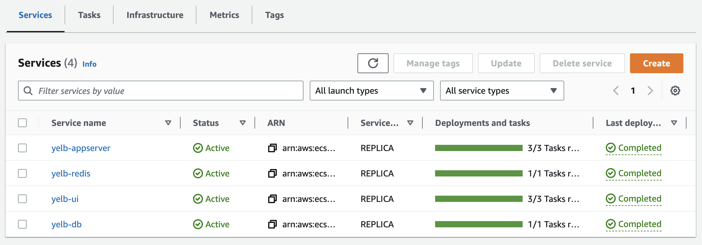

# Migrate existing Amazon ECS services from service discovery to Amazon ECS Service Connect configured services

Jessica Deen, Principal Developer Advocate, ECS

At re:Invent 2022 in November of last year we announced a new Amazon Elastic Container Service (Amazon ECS) solution for service-to-service communication called Amazon ECS Service Connect. Amazon ECS Service Connect enables easy communication between microservices and across virtual private clouds (VPCs) by leveraging AWS Cloud Map namespaces and logical service names. This allows you to seamlessly distribute traffic between your ECS tasks without having to deploy, configure, and maintain load balancers.

Today's post will focus on how to migrate your existing ECS tasks from using service discovery and load balancers to using the new Amazon ECS Service Connect functionality.

## Overview of Solution

To demonstrate how easy it is to migrate your existing ECS services, we will use a sample YELB application hosted on GitHub [here](https://github.com/aws-samples/ecs-service-connect-yelb-sample-app). This sample application currently uses an internal load balancer and an alias record in a private hosted zone for `yelb-appserver` service discovery and AWS Cloud Map for `yelb-redis` and `yelb-db` service discovery. Below is an architectural diagram of the sample application:


## Walkthrough

For this sample migration to work, we will need the following resources:

- A VPC
- pair of public and private subnets spread across two availability zones
- an internet gateway, with a default route on the public subnets
- a pair of NAT gateways (one in each AZ)
- default routes for the NAT gateways in the private subnets
- IAM roles for the sample YELB application tasks and task execution roles
- Security groups for the YELB app service components
- Service discovery namespaces for the YELB app components
- 1 External Load Balancer and target groups to expose the YELB UI app
- 1 Internal Load Balancer and target groups to expose the YELB app server
- 1 ECS Cluster
- ECS service and ECS task definitions deployed

## Prerequisites

For this walk through, you will need the following pre-requisites:

- An AWS Account
- Access to a shell environment. This can be a shell running in an [AWS Cloud9 Instance](https://aws.amazon.com/cloud9/), [AWS CloudShell](https://aws.amazon.com/cloudshell/), or locally on your system.
- Your shell environment will need to have [git](https://git-scm.com/downloads) installed and the [AWS CLI](https://docs.aws.amazon.com/cli/latest/userguide/getting-started-install.html) configured with version 2.9.2 or higher
- Your AWS CLI will need to have a profile [configured with access to the AWS account](https://docs.aws.amazon.com/cli/latest/userguide/cli-configure-quickstart.html) you wish to use for this walk through
- Enable the new Amazon ECS Console, if not already enabled. 
  You may do so by toggling the radio button in the top left corner of the [Amazon ECS Console](https://console.aws.amazon.com/ecs/v2/clusters). 
  
  
  
  To learn about the differences between the classic and new console experience, checkout [our docs](https://docs.aws.amazon.com/AmazonECS/latest/developerguide/new-console.html).

### Step 1: Setup Infrastructure and Deploy Sample App

To begin, you need to have the sample code downloaded to the computer or shell environment you will be using for this walk through. If you have not yet done so, from your terminal, run the following command to clone a copy of [the provided GitHub Repo]() to your system.

```sh
git clone https://github.com/aws-samples/ecs-service-connect-yelb-sample-app && cd ecs-service-connect-yelb-sample-app
```

To simplify the setup experience, we created an AWS Cloudformation template which will provision the necessary infrastructure, service, and task deployments needed for this walkthrough.

We also created a simple setup script for you to use from the shell environment of your choice to deploy the provided CloudFormation template. The script takes 4 optional arguments:

1. `AWS_PROFILE`: Name of the AWS CLI profile you wish to use. If you do not provide a value `default` will be used.
2. `AWS_DEFAULT_REGION`: Default Region where Cloud Formation Resources will be deployed. If you do not provide a value `us-west-2` will be used.
3. `ENVIRONMENT_NAME`: Environment Name for ECS cluster. If you do not provide a value `ecs` will be used.
4. `CLUSTER_NAME`: Desired ECS Cluster Name. If you do not provide a value `yelb-cluster` will be used.

To use the setup script with all arguments, you would run the following command:

```sh
./scripts/setup.sh my-profile us-east-2 my-ecs-environment my-ecs-cluster
```

If you prefer watching the Cloudformation deployment through the console, you may do that [here](https://console.aws.amazon.com/cloudformation/home).

> Note: Be sure to select the correct region in the console for where you instructed the deployment to go.

The setup script will take around 5 minutes to complete.

> Note: It may take some time for every service and task to come to a `RUNNING` state.

Once the deployment has completed successfully, you will see output similar to the following:

```sh
Waiting for changeset to be created..
Waiting for stack create/update to complete
Successfully created/updated stack - yelb-serviceconnect

 Access your YELB application here: http://yelb-serviceconnect-382017218.us-east-2.elb.amazonaws.com/
```

View the sample YELB application through the deployed elastic load balancer using the provided URL. If you need, you will also find this URL in the [Cloudformation outputs](https://docs.aws.amazon.com/AWSCloudFormation/latest/UserGuide/cfn-console-view-stack-data-resources.html). Below is an example:


Below is an example of the sample application you just deployed:



Navigate to the [Amazon ECS Console](https://console.aws.amazon.com/ecs/v2/clusters) and visually verify all services and tasks are in the `RUNNING` state.

> Note: You will want to ensure you are viewing the ECS Console for the region you chose to deploy the CloudFormation Template.

When all tasks and services are in the `RUNNING` state, your ECS cluster should look similar to the below examples:


### Step 2. Generate Traffic for Internal Load Balancer

Now that we have our sample application and all required infrastructure deployed, we are ready to generate some traffic using the application endpoint. To do this, we created a simple `./scripts/generate-traffic.sh` script for you to use.

To use the provided `generate-traffic.sh` script, you would use the following command:

```sh

./scripts/generate-traffic.sh
```

While the script runs, watch your ECS Cluster's services, specifically, the yelb-appserver. You may notice the tasks begin to fail due to the intense load. Below is an example of a service with failing tasks that are still in the process of self-healing:


When this happens, if you try to access the YELB appserver API in your browser with the the applicaton URL and the path `/api/getvotes` I.E `http://yelb-service-connect.us-east-2.elb.amazonaws.com/api/getvotes`, you may also see a 500 error similar to the following:


These dropped requests due to high load and DNS propagation is an important thing to keep in mind, as we will revisit this topic after we upgrade to Amazon ECS Service Connect.

Once the script completes, you will see a message similar to the following:

```sh
Successfully created/updated stack - hey-loadtest

 Running Hey Loadtest with 100 workers and 10,000 requests for 2 minutes...

 Please wait...

Hey Loadtest for: http://yelb-serviceconnect-319970139.us-east-2.elb.amazonaws.com/ complete!
View the EC2 Load Balancer Console here: https://console.aws.amazon.com/ec2/home#LoadBalancers
Be sure to choose the correct region for your deployment.
```

### Step 3: View Monitoring Metrics for Service Discovery and Internal Load Balancer

To view the traffic you just generated using the monitoring metrics tab in the EC2 Load Balancer dashboard, navigate to the provided URL: https://console.aws.amazon.com/ec2/home#LoadBalancers. Be sure to select the appropriate region for your deployment.

Once you are in the Load Balancers console, select the `serviceconnect-appserver` instance, which should have a DNS prefix name similar to `internal-serviceconnect-appserver-xxxx`. Below is an example:



From within the serviceconect-appserver page, navigate to the “Monitoring” tab.



From the monitoring tab, if you adjust the time options to a 1hr period, you should see spikes similar to the following example:


### Step 4: Cloud Map Namespaces

We are almost ready to upgrade to Amazon ECS Service Connect, but before we do, I want to point out AWS Cloud Map namespaces that were created for you during the Cloudformation template deployment. If you navigate to the [AWS Cloud Map Console](console.aws.amazon.com/cloudmap/home/namespaces), you'll see the two namespaces hat were created for you.

> Note: If you don't see any namespaces in the Cloud Map Console, be sure to select the correct region for your deployment.

Below is an example of what you should see:


One namespace is for Service Discovery and the other is for Amazon ECS Service Connect. If you click on the one for Amazon ECS Service Connect, and scroll down, you'll notice there aren't currently any services attached to it.



We'll keep an eye on this namespace after we move our services to Amazon ECS Service Connect and we'll notice how things change.

### Step 5: Migrate to Amazon ECS Service Connect

Now we are ready to migrate from service discovery to Amazon ECS Service Connect. After the migration is complete, the sample application architecture will look like this:


For this migration example, we will be using the AWS CLI to update the 4 services that make up this sample YELB application.

To simply the commands needed, we have created a `./scripts/use-service-connect.sh` script for you to use.

To use the provided `use-service-connect.sh` script, you would use the following command in the shell environment of your choice:

```sh
./scripts/use-service-connect.sh
```

Once the script completes, you should see output similar to the following example:

```sh
Updating yelb-db...
Updating yelb-redis...
Updating yelb-appserver...
Updating yelb-ui...
Amazon ECS Service Connect migration complete!
```

Great! Now that the migration is complete, let's head back on over to the AWS Cloud Map Console and check on the Amazon ECS Service Connect namespace. We should now see 3 services attached to this namespace. Below is an example:


> Note: While the migration from Service Discovery to Amazon ECS Service Connect is complete, it may take some time for the ECS Services and Tasks to be in a ready or `RUNNING` state again.

### Step 6: What changed?

Let’s break down what changed when we ran the `./scripts/use-service-connect.sh` script.

In a code editor of your choice, open the `./scripts/use-service-connect.sh` file. Take note of the `aws ecs update-service` command used at the end of the script, specifically the `--service-connect-configuration` flag; this is the flag handling sending the new configuration to the Amazon ECS API.

If we take a look at the [AWS CLI Documentation for the ecs update-service command](https://awscli.amazonaws.com/v2/documentation/api/latest/reference/ecs/update-service.html), we can see the `--service-connect-configuration` flag is expecting a JSON structure.

> Note: You cannot use a YAML service-connect-configuration file at this time; it must be JSON.

If we cross reference that guidance with our script, you'll notice each command starting from line 32 and on uses that flag with a json file referenced. Below is an example of the update service command for the `yelb-db` service.

```sh
aws ecs update-service \
    --region "${AWS_DEFAULT_REGION}" \
    --cluster $CLUSTER_NAME \
    --service $SVC_DB \
    --service-connect-configuration file://sc-update/svc-db.json >/dev/null
```

The `--service-connect-configuration` flag is referencing a `svc-db.json` file located in the `sc-update/` directory of the provided GitHub repo. Open the `sc-update/svc-db.json` file to see how line 2 has the key `enabled` set to a value of `true`. Below is an example of the same `svc-db.json` file:

```json
{
  "enabled": true,
  "namespace": "yelb.sc.internal",
  "services": [
    {
      "portName": "yelb-db",
      "clientAliases": [
        {
          "port": 5432,
          "dnsName": "yelb-db.yelb.cloudmap.internal"
        }
      ]
    }
  ],
  "logConfiguration": {
    "logDriver": "awslogs",
    "options": {
      "awslogs-group": "ecs/serviceconnectdemo",
      "awslogs-region": "us-west-2",
      "awslogs-stream-prefix": "db-envoy"
    }
  }
}
```
From the sample code snippet above, pay attention to the `dnsName` key on line 10. Notice it is still pointing to the load balancer's service discovery ID. To avoid changing your applications in client Amazon ECS services, we set this to the same name the client `yelb-ui` service uses by default. I.E `yelb-db.yelb.cloudmap.internal`

For more examples, click through the svc json files in the `sc-update` directory to see the Amazon ECS Service Connect configuration for each service.

### Step 7: View Monitoring Metrics for Internal Load Balancer for Amazon ECS Service Connect

Once the migration is complete, navigate to the [ECS Console](https://console.aws.amazon.com/ecs/v2/clusters) and verify all the services and tasks are in the `RUNNING` state. This may take some time as the existing tasks will have to be stopped and the new tasks should come up as shown below:




Once all services and tasks are in the `RUNNING` state, go ahead and generate traffic for the application endpoint again using the `./generate-traffic.sh` script and the following command:

```sh
./scripts/generate-traffic.sh
```

While the load test is running, keep an eye on the services in your ECS Cluster the same as you did when you ran the load test earlier.

You should see tasks fail and try to self-heal just as they did before. Below is another example:


However, if you try to access the YELB App Server Api using the application URL + the path `/api/getvotes`, I.E `http://yelb-service-connect.us-east-2.elb.amazonaws.com/api/getvotes`, you shouldn't see any 500 errors. This is because of the way Amazon ECS Service Connect handles retries and requests; there may be increased latency, but you should no longer see any dropped requests.

Now, just as we did previously, let’s navigate to the EC2 Load Balancer console and choose the app server’s internal load balancer again. Under the monitoring tab, you should now notice the app server traffic is no longer served by the internal load balancer after the service migration from service discovery to Amazon ECS Service Connect! This is evident by the requests dashboard not seeing any new traffic. Below is an example:


## Cleaning Up

To avoid future charges, one final step to finish with this tutorial is to clean up what we created. To make it easier, we created a `./scripts/cleanup.sh` script for you to use.

To use the provided `cleanup.sh`, run the following command:

```sh
./scripts/cleanup.sh
```

> Note: The clean up script will take around 20 minutes to complete.

## Conclusion

Congratulations! You just learned how to migrate from service discovery to the new Amazon ECS Service Connect! To learn more about Amazon ECS Service Connect, check out [our session from re:Invent 2022](https://www.youtube.com/watch?v=1_YUmq3MpYQ) and [our docs](https://docs.aws.amazon.com/AmazonECS/latest/developerguide/service-connect.html). 

## Author Bio

Jessica is currently a Principal Developer Advocate at [AWS](https://aws.amazon.com/) focusing on [Elastic Container Service](https://aws.amazon.com/ecs/). She previously worked for Microsoft in a variety of capacities for over a decade. She began as a vendor in April of 2009, became a full time employee in March of 2016, and left in 2022 to join AWS. Prior to joining Microsoft, she spent over a decade as an IT Consultant / Systems Administrator for various corporate and enterprise environments, catering to end users and IT professionals in the San Francisco Bay Area. Jessica holds three Microsoft Certifications (MCP, MSTS, Azure Infrastructure), 3 [expired] CompTIA certifications (A+, Network+, and Security+), 4 Apple Certifications, and is a former 4-year Microsoft Most Valuable Professional for Windows and Devices for IT. In 2013, she also achieved her [FEMA Professional Development Series (PDS)](https://training.fema.gov/is/searchis.aspx?search=PDS) certification from the U.S Department of Homeland Security, which recognizes her communication, leadership, influence, problem solving, and decision making abilities during times of crisis and emergency.

When she’s not doing something geeky, you can find her doing something active with her family, most likely camping or hiking. She also enjoys biking, shooting, eating, reading, and hanging with her 10-year-old rescue pup Miley and her 2-year-old pandemic puppy, Drake. Yes, both dogs are named after celebrities.
